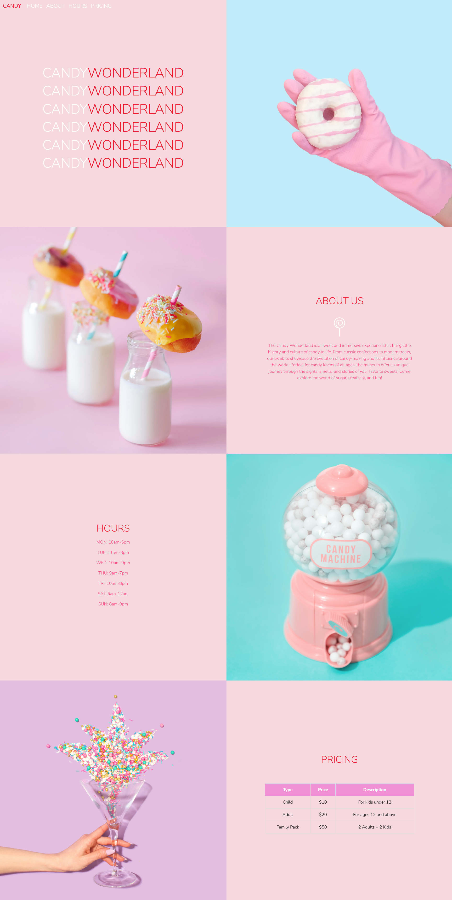

# candy-wonderland

This is a one-page simple front-end project. 

## Table of contents

  - [Features](#features)
  - [Screenshot](#screenshot)
  - [Links](#links)
  - [Built with](#built-with)

### Features

- Fully Responsive: Viewers are able to view the website on different device sizes, elements stack differently on different device sizes. 
- Navbar to Sections: Visitors can click on Navbar items and it brings them to the relevant section of the website. 

### Screenshot

### Links

- Live Site URL: [https://waiyeetung.github.io/candy-wonderland/]

### Built with

- HTML
- CSS
- Flexbox
- Bootstrap
- Javascript
- jQuery
